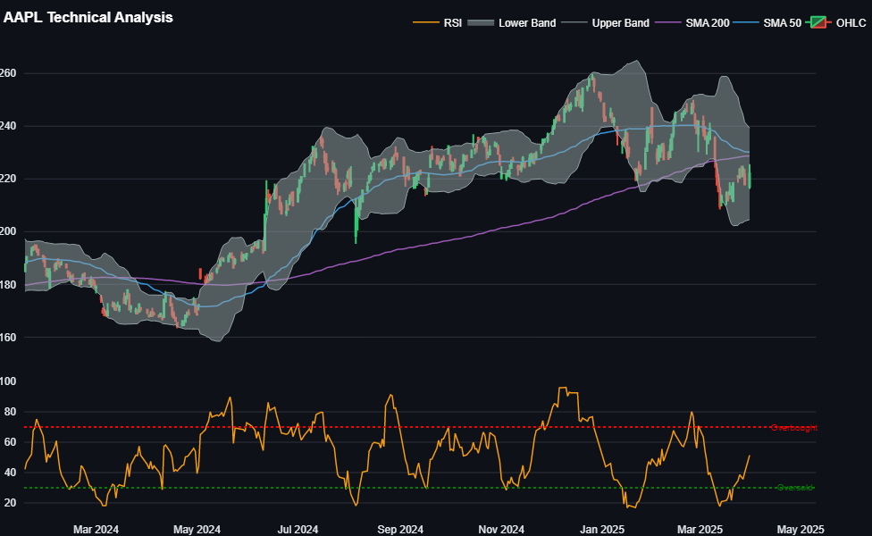
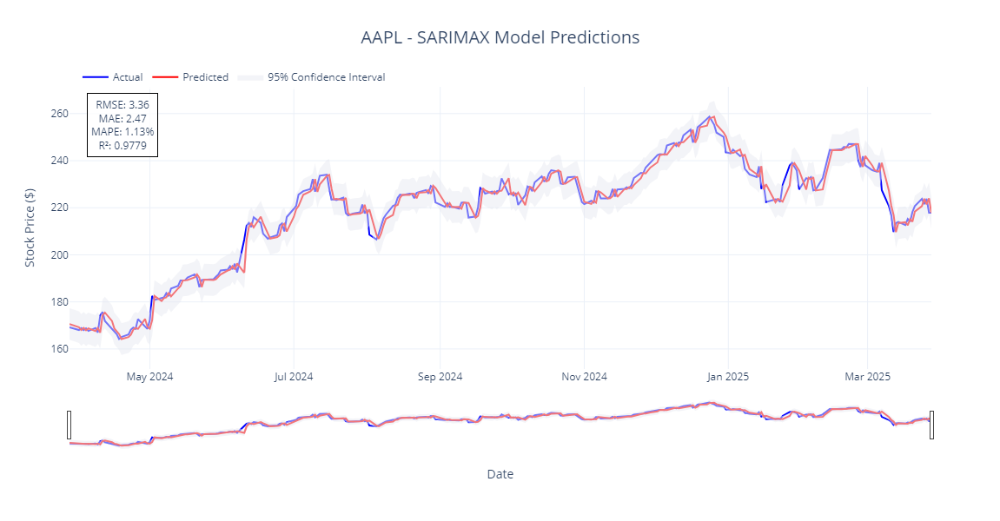
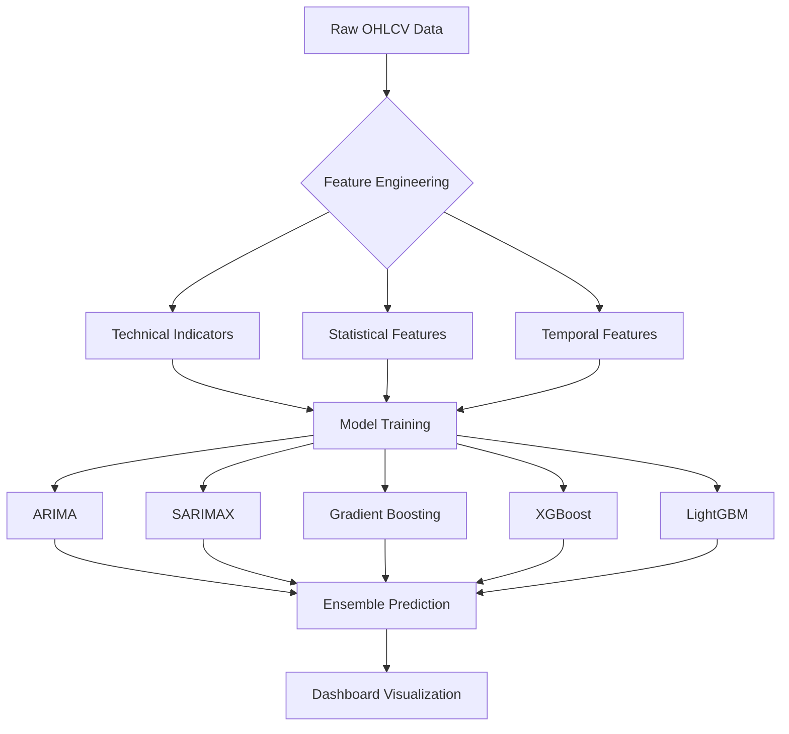

# 📈 INVESTO - AI-Powered Stock Prediction Platform

  
*Professional-grade quantitative trading analytics powered by machine learning*

## 🚀 Overview

INVESTO is an advanced stock prediction system that combines:
- **Time Series Forecasting** (ARIMA, SARIMAX)
- **Ensemble Machine Learning** (Gradient Boosting, XGBoost, LightGBM)
- **Technical Analysis Indicators** (50+ features)
- **Interactive Visualization**

Prototype Built for traders, analysts, and quantitative researchers to make data-driven investment decisions.

## ✨ Key Features

| Feature | Description | Technology |
|---------|-------------|------------|
| **Multi-Model Forecasting** | Ensemble of 5 prediction models with consensus analysis | ARIMA, SARIMAX, GB, XGB, LGB |
| **Technical Analysis** | 50+ indicators including RSI, MACD, Bollinger Bands | TA-Lib, Pandas |
| **Professional Dashboard** | Institutional-grade visualization | Plotly, Streamlit |
| **Automated Feature Engineering** | Dynamic feature generation pipeline | Scikit-learn |
| **Model Comparison** | Side-by-side performance metrics | MLflow, Pickle |

## 📊 Sample Outputs

### Interactive Technical Analysis

*Real-time candlestick charts with overlay indicators*

### Model Performance Comparison

*RMSE, MAE, and R² metrics across all models*

### Prediction Consensus

*Ensemble forecast with confidence intervals*

## 🛠️ Installation

1. Clone the repository:
```bash
git clone https://github.com/jayash1973/INVESTO-Stock-Predictor.git
cd INVESTO-Stock-Predictor
```

2. Create virtual environment:
```bash
python -m venv venv
source venv/bin/activate  # Linux/Mac
venv\Scripts\activate  # Windows
```

3. Install dependencies:
```bash
pip install -r requirements.txt
```

## 🏗️ Project Structure
```
INVESTO-Stock-Predictor/
├── artifacts/              # Serialized models and processed data
│   ├── train_test_splits/  # Time-based splits
│   ├── engineered_data/    # Feature-enhanced datasets
│   └── scalers/            # Normalization objects
├── logs/                   # Training logs
├── src/                    # Core application code
│   ├── components/         # Modular ML components
│   ├── pipeline/           # Training/prediction workflows
│   └── utils.py            # Helper functions
├── app.py                  # Streamlit application
└── requirements.txt        # Dependency specification
```

## 🧠 Model Architecture


## 💻 Usage

1. Run the Streamlit app:
```bash
streamlit run app.py
```

2. Configure Analysis:
   - Select stock ticker (AAPL, GOOGL, etc.)
   - Choose date range (1Y, 5Y, custom)
   - Toggle technical indicators

3. Generate Predictions:
   - Click "Generate Predictions" button
   - View model consensus forecast
   - Analyze individual model performance

## 📈 Technical Indicators

| Category | Indicators | Description |
|----------|------------|-------------|
| Trend | SMA(50,200), EMA(20) | Moving averages for trend identification |
| Momentum | RSI(14), MACD(12,26,9) | Speed and direction of price changes |
| Volatility | Bollinger Bands, ATR | Price fluctuation measurements |
| Volume | OBV, VWAP | Trading activity analysis |
| Cycle | Fourier Transforms | Periodic pattern detection |

## 🤖 Machine Learning Models

### Time Series Models
| Model | Parameters | Use Case |
|-------|------------|----------|
| ARIMA | (p=2,d=1,q=2) | Baseline price prediction |
| SARIMAX | (2,1,2)x(1,1,1,5) | Seasonal pattern capture |

### Ensemble Models
| Model | Key Features | Strengths |
|-------|--------------|-----------|
| Gradient Boosting | n_estimators=200, max_depth=4 | Handles non-linear relationships |
| XGBoost | learning_rate=0.05, subsample=0.8 | Regularization prevents overfit |
| LightGBM | num_leaves=31, min_data_in_leaf=5 | Fast training on large datasets |

## 📚 EDA Insights

### Feature Importance

*Top predictive features across models*


## 📜 License
This project is licensed under the MIT License - see the LICENSE file for details.

## 🤝 Contribution
We welcome contributions! Please follow these steps:

1. Fork the repository
2. Create your feature branch (`git checkout -b feature/AmazingFeature`)
3. Commit your changes (`git commit -m 'Add some AmazingFeature'`)
4. Push to the branch (`git push origin feature/AmazingFeature`)
5. Open a Pull Request

## 📧 Contact
For professional inquiries:
- jayashbhardwaj294@gmail.com
- [Project GitHub](https://github.com/jayash1973/INVESTO-Stock-Predictor)